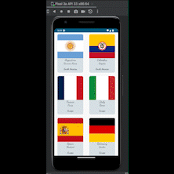

# Android Jetpack Compose Recyclerview - Country list.

In this project you will see a list of contries (that I haved traveled so far) :sweat_smile:

This is a recycler view as grid layout wrote in Jetpack Compose and it has a TextButton that scrolls up to go to the first item in the recyclerview. 

---

In this project you will see a sticky header implemented as well, just keep in mind that when you want to see how it works, go to the
"preview" and uncomment this line of code:

```
    CountryStickyHeader()
```

## Resources:books:

* [Jetpack Compose Course](https://www.udemy.com/course/jetpack-compose-desde-0-a-profesional/) 

## App Demo



---
## Author
* **Daniela Ramirez Gomez** - [danyramirezg](https://github.com/danyramirezg)
